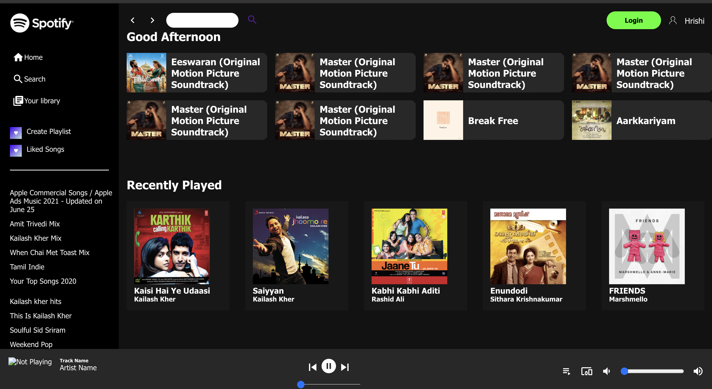

### Spotify Mini Clone

A simple Spotify Clone built using the Spotify web-playback sdk.

### Features
1. Playback controls for songs.
2. Search for your favourite artits,albums or playlists.

### Techstack

__Frontend__

<li >React JS </li>

__Backend__ 

<li>FastAPI</li>

## HomePage

## Search Page

## Steps to setup the project

#### Frontend
1. Clone the repository
2. Install all the required node dependencies using npm/yarn (`npm install ` or `yarn install`)
3. Run `yarn/npm start`

#### Backend
1. Backend code is in the spotify-backend directory.
2. Install all the required dependencies using pip(`pip install -r requirements.txt` )
3. Run the command `uvicorn --reload login:app`

__NOTE__: You'll need a Client ID for setting up a connection with the API.

#### You can create one here.
 (https://developer.spotify.com/dashboard/applications )

